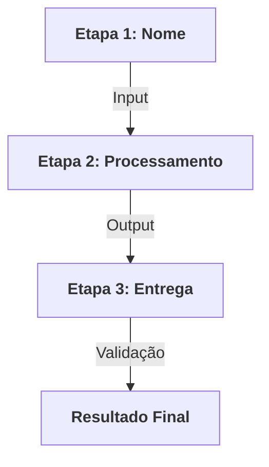

# 📊 [NOME_DO_PROJETO]

[DESCRICAO_CURTA_E_IMPACTANTE]

---

## 📌 Resumo Executivo

Este repositório contém a [NOME_DA_SOLUCAO], uma ferramenta projetada para [OBJETIVO_PRINCIPAL]. O sistema [O_QUE_A_SOLUCAO_FAZ_EM_UMA_FRASE], garantindo que [PUBLICO_ALVO] consiga [PRINCIPAL_BENEFICIO].

## 🏗️ Fluxo de Funcionamento

## ✨ Funcionalidades Principais

-   **[FUNCIONALIDADE_1]**: [Descricao_Breve].
-   **[FUNCIONALIDADE_2]**: [Descricao_Breve].
-   **[FUNCIONALIDADE_3]**: [Descricao_Breve].
-   **Matriz de Benchmark**: Tabela comparativa responsiva para análise rápida de mercado.
-   **Inteligência Sistematizada**: Skills integradas que garantem consistência e alta fidelidade.

## 🚀 Como Visualizar os Resultados

[INSTRUCAO_DE_ACESSO_OU_DEPLOY]

🔗 [**Link para Visualização Online (Live Demo)**]([URL_DO_PROJETO])

## 🛠️ Stack Técnica

| Componente | Tecnologia | Papel |
| :--- | :--- | :--- |
| **Interface** | [TECNOLOGIA] | [PAPEL_NO_PROJETO] |
| **Linguagem** | [TECNOLOGIA] | [PAPEL_NO_PROJETO] |
| **Design** | Padrão Medium.com | UX Editorial e Autoridade |
| **Controle** | Git / GitHub | Sincronização e Versionamento |

---
> [!TIP]
> **Dica Executiva**: [DICA_ESTRATEGICA_PARA_O_LEITOR].

---
© 2026 [NOME_DA_EMPRESA] · [DEPARTAMENTO]
