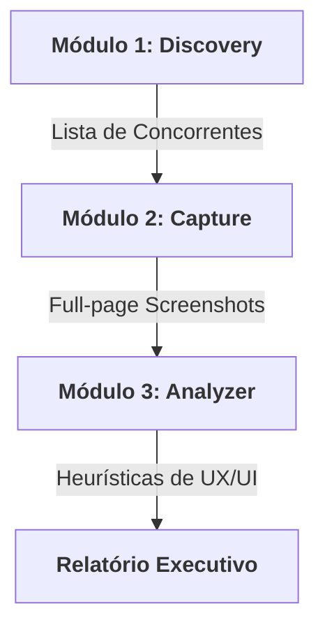

# 📊 CRO Master Pro (v2.0)

Suite de ferramentas avançada para pesquisa de mercado, captura de UI/UX e análise de conversão (CRO).

👉 **[Leia o Guia Didático de Uso (GUIDE.md)](./GUIDE.md)**

---

## 📌 Resumo Executivo

Este repositório contém o **CRO Master Pro (v2.0)**, uma solução integrada para realizar auditorias competitivas de alta fidelidade. O sistema automatiza a descoberta de concorrentes, captura interfaces em alta definição e gera relatórios analíticos premium seguindo padrões editoriais de elite, garantindo diagnósticos estratégicos com agilidade e precisão.

## 🏗️ Fluxo de Funcionamento

## ✨ Funcionalidades Principais

-   **CRO Discovery**: Pesquisa automatizada baseada em IA para mapear o ecossistema de concorrentes.
-   **CRO Capture**: Engine de renderização para captura de UI ignorando popups e modais.
-   **CRO Analyzer**: Escaner analítico que gera relatórios HTML interativos com benchmarking.
-   **Estrutura Escalável**: Organização modular de clientes e ativos de análise.

## 📁 Estrutura do Projeto

-   `src/`: Scripts de lógica e utilitários de rastreamento.
-   `data/`: Repositório de resultados organizados por cliente.
-   `tests/`: Scopes de teste para validação de fluxos.
-   `.agents/`: Inteligência do agente (Skills e Workflows).
    -   `skills/`: Habilidades modulares de marketing e análise.
    -   `workflows/`: Fluxos de trabalho automatizados.

## 🚀 Como Iniciar

Para executar uma análise completa, siga o workflow definido:
1. Abra o arquivo `.agents/workflows/run-cro-analysis.md`.
2. Siga as etapas de execução utilizando as skills correspondentes.

## 🛠️ Stack Técnica

| Componente | Tecnologia | Papel |
| :--- | :--- | :--- |
| **Logic** | Node.js / Playwright | Automação e Scraping |
| **Analysis** | Agentic AI Skills | Diagnóstico e Heurísticas |
| **Design** | Editorial High-Fidelity | UX Premium |
| **Storage** | Estrutura Local | Persistência de Dados |

---
> [!TIP]
> **Dica Executiva**: Sempre revise o `competitors.json` gerado pelo Discovery antes de iniciar o Capture para garantir que o benchmarking esteja focado nos players certos.

---
© 2026 APVS Brasil · Inteligência Estratégica
