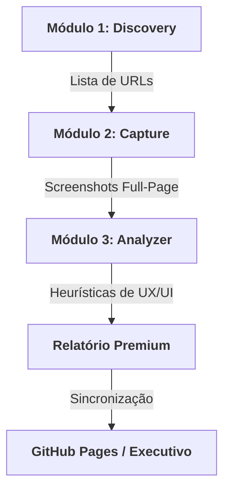

# 📊 Suite de Análise Competitiva: CRO Pro

Uma plataforma de auditoria estratégica para o setor de proteção veicular, projetada para transformar dados brutos de concorrência em decisões de marketing de alto impacto.

---

## 📌 Resumo Executivo

Este repositório contém a **Suite CRO Pro**, uma ferramenta automatizada que mapeia o ecossistema digital de associações e seguradoras. O sistema executa desde a descoberta de novos players até a geração de relatórios editoriais de alta fidelidade (padrão Medium), permitindo que a **APVS Brasil** mantenha sua liderança através de benchmarking preciso e otimização da taxa de conversão (CRO).

## 🏗️ Fluxo de Funcionamento

## ✨ Funcionalidades Principais

-   **Mapeamento Automatizado**: Descoberta de proposta de valor e CTAs da concorrência via `cro-discovery`.
-   **Captura de Alta Definição**: Screenshots de 1440px que contornam modais e lazy-loads (`cro-capture`).
-   **Relatório Editorial**: Geração de HTML premium com tipografia refinada e análise em 4 tópicos (`cro-analyzer`).
-   **Matriz de Benchmark**: Tabela comparativa responsiva para análise rápida de mercado.
-   **Inteligência Sistematizada**: Skills integradas que garantem consistência em todas as auditorias futuras.

## 🚀 Como Visualizar os Resultados

O relatório final da análise realizada para a **APVS Brasil** pode ser acessado diretamente:

🔗 [**Relatório Online (Live Demo)**](https://willerjhonas.github.io/An-lise-competitiva/APVS%20Brasil/analise_competitiva.html)

## 🛠️ Stack Técnica

| Componente | Tecnologia | Papel |
| :--- | :--- | :--- |
| **Interface** | HTML5 / CSS3 (Vanilla) | Relatórios de alta fidelidade |
| **Linguagem** | JavaScript (ES6+) | Motores de captura e análise |
| **Design** | Padrão Medium.com | UX Editorial e Autoridade |
| **Controle** | Git / GitHub | Sincronização e Versionamento |

---
> [!TIP]
> **Dica Executiva**: Utilize o link da "Matriz" no menu superior para comparar rapidamente os diferenciais de produto entre as 9 maiores associações do Brasil.

---
© 2026 APVS Brasil · Suite de Inteligência de Mercado
