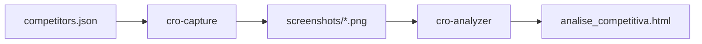

# 🛠️ Especificação Técnica: CRO Master Pro (v2.0)

Documentação de arquitetura e infraestrutura do sistema de análise.

---

## 🏗️ Arquitetura do Sistema

A suite é baseada em um modelo de **Pipeline de Inteligência Baseado em Agentes**, onde cada módulo tem uma responsabilidade única e gera um artefato para o próximo estágio.

### Fluxo de Dados

## 🛠️ Detalhes dos Componentes

### 1. cro-capture
- **Engine**: Browser-based capture.
- **Resolução**: 1440px width (Full-page).
- **Tratamento**: Contorna banners de cookies e modais de newsletter para uma captura limpa.

### 2. cro-analyzer
- **Framework Visual**: Vanilla CSS com variáveis de design customizadas (Padrão Medium).
- **Tipografia**: Importação via Google Fonts (Spectral e Inter).
- **Matriz**: Implementação de `sticky columns` e `horizontal scroll overflow`.

## 📂 Estrutura de Diretórios

- `/.agents/skills/`: Contém o cérebro (scripts e instruções) dos agentes.
- `/APVS Brasil/`: Pasta de exemplo com a última análise consolidada.
- `/docs/`: Documentação técnica e manuais.
- `README.md`: Porta de entrada do repositório (Template).

## 🔒 Segurança e Versionamento
- **Git**: Todo o histórico de auditorias deve ser versionado para acompanhar a evolução dos concorrentes ao longo do tempo.

---
© 2026 APVS Brasil · Inteligência Estratégica
